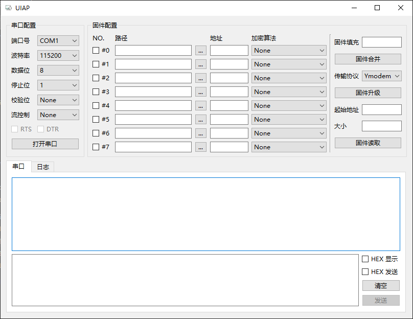

# uiap

> [pyqt6-vs-pyside6]

一个简易的 Bootloader 上位机(PySide6)

## 功能描述

1. 支持命令行模式 CLI 和图形界面 GUI
2. 命令行模式和图像界面模式支持读取配置文件

    + 配置文件默认从命令运行路径开始查找 `.uiap` 的隐藏文件夹下的 `settings.cfg`
    + 配置文件可以通过命令行参数指定配置文件路径

### 图形界面



#### 图形界面说明

0. 打开图形界面
1. 串口配置：选择串口，波特率，数据位，停止位，校验位，流控制，RTS/DTR 后，可打开串口

    + 串口：实时扫描可用的串口
    + 波特率：9600, 115200 等
    + 数据位：5, 6, 7, 8
    + 停止位：1, 1.5, 2
    + 校验位：None, Odd(奇校验), Even, Mark, Space
    + 流控制：None, Software, Hardware
    + RTS/DTR：流控制为 Hardware 时，RTS(CTS)/DTR(DSR) 流控制

2. 固件配置：

    + No.：可以选择是否需要烧写固件
    + 路径：显示固件路径，右边的工具按钮(tool button)可以通过打开文件管理器来选择固件(目前只支持 bin 文件)
    + 地址：该固件烧写的起始地址
    + 加密算法：该固件使用的加密算法

3. 固件合并：点击后，将多个固件进行合并

    + 将固件配置中勾选的固件按起始地址进行合并，并用 "固件填充" 来进行填充

4. 固件升级：点击后，通过串口进行固件写入

    + 获取 "固件配置" 和 "协议配置" 中的值
    + 按序号，依次将固件进行加密后，通过选定的 "传输协议" 发往串口
    + **注**：会在原固件路径下生成一个加密后的固件(加密后的固件名为: [原固件名]_[加密算法].bin)

5. 固件读取：点击后，通过串口进行固件读取

    + 通过选定的 "传输协议" 从串口读取固件(需要指定读取的起始地址和大小)

6. 串口选项卡：上下分别为数据显示区域和串口发送区域

    + 数据显示区域：显示串口收发数据
    + 串口发送区域：
    + 串口发送输入框：编辑串口发送数据
        + HEX 显示：控制 "数据显示区域" 显示的内容是否为十六进制文本
        + HEX 发送：控制串口发送的数据是否为十六进制文本("串口发送输入框"显示的内容是否为十六进制文本)
        + 清空按钮：清空 "数据显示区域"
        + 发送按钮：发送 "串口发送输入框" 中的数据

7. 日志选项卡：输出日志信息

## 目录结构

```sh
uiap
├── .uiap             # 隐藏文件-存放配置文件
|   ├── settings.json
├── config            # 用户配置
|   ├── config.py
├── core
|   ├── crypto        # 加密算法
|   |   ├── crypto.py
|   ├── protocol      # 传输协议
├── gui               # 图形界面
|   ├── gui_uiap.py   # 主界面
|   ├── serial_rx_tx_item.py  
|   ├── serial_thread.py  
|   ├── gui_uiap.py   # uiap.ui 生成的 py 文件
├── ui                # 界面设计
|   ├── uiap.ui       # QT Designer 生成的 ui 文件
├── utils
|   ├── log.py        # 日志模块
├── main.py           # 主程序
```

## TODO

+ [ ] 固件升级: 配合加密算法，目前只支持 None
+ [ ] 固件读取: 起始地址和大小当前不起作用
+ [ ] 固件升级过程中关闭程序会导致未响应

### bug1. 连接按钮的点击信号，发现槽函数被调用多次

> PyQt6 存在改问题，PySide6 不存在该问题

描述：代码中存在 `self.serial_open_btn` 按钮，和点击时的槽函数 `on_serial_open_btn_clicked`

现象：

1. 如果代码中未显式执行 `self.serial_open_btn.clicked.connect(self.on_serial_open_btn_clicked)`

    + 槽函数会被连续调用 3 次

2. 如果代码中显式执行 `self.serial_open_btn.clicked.connect(self.on_serial_open_btn_clicked)`

    + 槽函数会被连续调用 2 次

3. 如果设置 `QMetaObject.connectSlotsByName = lambda *args: None`

    + 则当进行 `connect` 后，槽函数才会被调用

4. 如果设置 `QMetaObject.connectSlotsByName = lambda *args: None`

    + 槽函数会被连续调用 2 次

5. 如果槽函数更名为 `on_serial_open_btn_clicked2`

    + 则当进行 `connect` 后，槽函数才会被调用

[pyqt6-vs-pyside6]: https://www.pythonguis.com/faq/pyqt6-vs-pyside6/
